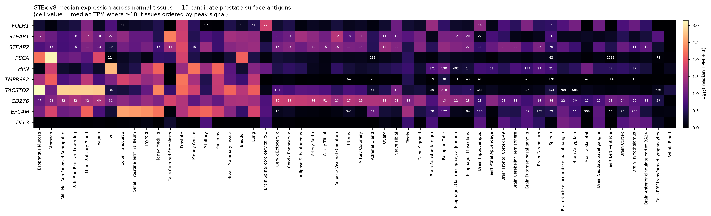

# Normal-tissue expression and on-target/off-tumor risk of 10 candidate prostate surface antigens

**Targets:** FOLH1/PSMA, STEAP1, STEAP2, PSCA, HPN/hepsin, TMPRSS2, TACSTD2/TROP2, CD276/B7-H3, EPCAM, DLL3

## Methods & data sources
- **Transcript:** GTEx v8 (GENCODE v26, GRCh38), median TPM across all 54 tissue sites, via the pinned GTEx API. Gene symbols resolved to versioned GENCODE IDs before querying.
- **RNA + protein (IHC):** Human Protein Atlas release 25.1 — per-gene RNA tissue specificity/distribution, protein (IHC) tissue specificity and intensity, IHC **reliability category** (Enhanced > Supported > Approved > Uncertain), and subcellular location.
- **Toxicity, polarity, and concordance interpretation:** primary literature retrieved via OpenAlex; DOIs listed per claim below.
- **Interpretive rule:** HPA IHC "Not detected" is treated as evidence of absence **only** when the reliability category is Enhanced/Supported *and* transcript/literature agree. An *Uncertain* "Not detected" is treated as assay-limited, not biological absence.

## GTEx median-TPM heatmap
Median expression (log10 TPM+1) for the 10 antigens across 54 GTEx normal tissues; cell values show median TPM where ≥10; tissues ordered left→right by peak signal, which surfaces the high-risk normal sites (esophagus, stomach, skin, salivary gland, liver, kidney, GI, prostate, brain).

## Master risk table

| Antigen | Normal tissues/cell types (protein) | IHC reliab. | RNA↔IHC concordance | Apical/basolateral & access | Clinical toxicity | Risk note |
| --- | --- | --- | --- | --- | --- | --- |
| FOLH1 (PSMA) | Kidney proximal-tubule brush border, small intestine, salivary/lacrimal gland, CNS astrocytes/neuropil, prostate epithelium | Enhanced | Concordant | APICAL (renal PT brush border, gut) — luminal, largely shielded from blood; but salivary/lacrimal & CNS accessible to radioligands | Xerostomia (salivary), lacrimal, nephrotoxicity with 177Lu-PSMA RLT; well-documented on-target off-tumor | MODERATE. Broad normal expression but apical/enzymatic; toxicity real (salivary/kidney) yet clinically manageable. Well-validated target. |
| STEAP1 | Prostate epithelium; low-level bladder/testis; HPA IHC 'Not detected' (Uncertain, single Ab) | Uncertain | DISCORDANT (assay-limited — HPA underdetects) | Plasma-membrane, multi-span; prostate luminal epithelium | Xaluritamig (STEAP1xCD3): CRS predominant; limited off-tumor at doses tested — favorable prostate restriction | LOW-MODERATE. Prostate-restricted, low normal expression. Do NOT treat HPA 'Not detected' as proof of absence (Uncertain reliability). |
| STEAP2 | Prostate epithelium; scattered protein calls (cerebral cortex, fallopian tube) at low confidence | Uncertain | Partial (assay-limited) | Plasma-membrane; prostate luminal epithelium | No approved agent; expected prostate-restricted like STEAP1; toxicity profile unproven | LOW-MODERATE (uncertain). Prostate-enriched transcript; protein map low-confidence. Needs orthogonal protein validation. |
| PSCA | Stomach (mucous neck cells, strong), bladder/urothelium, esophagus, prostate; plasma membrane | Approved | Concordant | Plasma-membrane, GPI-anchored; urothelial/gastric — apical/luminal but urothelium accessible | PSCA-CAR T (mCRPC ph1): on-target activity; substantial normal stomach/bladder expression is the key off-tumor liability | MODERATE-HIGH. High normal GI/bladder protein confirmed. On-target off-tumor to stomach/urothelium is the dominant concern. |
| HPN (hepsin) | Liver (strong IHC), variable/weak kidney & pancreas at protein; prostate epithelium. Protein narrower than RNA | Approved | DISCORDANT (RNA broad liver+kidney+pancreas; protein concentrates in liver) — weak RNA/protein concordance | APICAL type-II transmembrane serine protease on epithelial luminal surface (bile canaliculi, renal tubule, prostate lumen) — luminal, less vascular-accessible | No approved agent; expected hepatic/renal on-target if protein present; protease activity adds functional risk | MODERATE. RNA overstates breadth; protein liver-dominant & apical. Concordance weak → protein data change the risk map. |
| TMPRSS2 | Prostate, lung (alveolar/airway epithelium), GI, kidney — protein documented in literature despite HPA IHC 'Not detected' | Enhanced (but scores 'Not detected') | DISCORDANT (HPA IHC negative vs high RNA + literature-confirmed protein) | APICAL type-II transmembrane serine protease; airway/prostate luminal surface | Mainly a fusion-partner/entry protease; not a mature ADC/T-cell target; expected lung/GI/prostate off-tumor if targeted | MODERATE. Broad epithelial protein (lung, GI, prostate). HPA 'Not detected' is misleading — transcript+literature indicate real protein. |
| TACSTD2 (TROP2) | Broad: skin keratinocytes, oral/esophageal squamous mucosa, salivary gland, breast, urothelium, lung, GI; plasma membrane | Enhanced | Concordant | Membranous at epithelial junctions (claudin/tight-junction regulator); largely basolateral/junctional but broadly present in skin & mucosa (accessible) | Sacituzumab govitecan: neutropenia, diarrhea, mucositis, skin/rash — reflect broad normal epithelial TROP2 (plus payload effects) | HIGH breadth. Very broad normal epithelial protein confirmed at high reliability. Therapeutic index depends on ADC payload/dose, not antigen restriction. |
| CD276 (B7-H3) | Broad low-level: epithelia, some endothelium, stroma, fibroblasts; protein often exceeds mRNA (post-transcriptional/miR-29) | Enhanced | Partial — protein > RNA (post-transcriptional de-repression) | Plasma-membrane; broad including vascular/stromal — vascular-accessible in some sites | ADC/CAR programs: broad normal protein raises off-tumor concern; toxicity dominated by payload; tumor overexpression vs normal is quantitative not qualitative | MODERATE-HIGH & UNDER-ESTIMATED BY RNA. Because protein exceeds transcript, a transcript-only estimate understates normal presence. Flag. |
| EPCAM | Broad simple/glandular epithelia: GI tract, hepatic bile ducts, kidney tubules, thyroid, pancreas, breast; strong membranous | Enhanced | Concordant | BASOLATERAL epithelial adhesion molecule (junctional); essential for gut barrier (loss→tufting enteropathy). Basolateral = less luminal but junctional/accessible | Catumaxomab (anti-EpCAM x CD3): cytokine effects, hepatotoxicity, GI; broad epithelial EpCAM drives on-target risk | HIGH breadth. Ubiquitous epithelial protein confirmed at high reliability. Off-tumor GI/hepatic risk intrinsic to target. |
| DLL3 | Minimal normal surface protein; predominantly intracellular (Golgi). HPA IHC 'Not detected'. Aberrant surface expression in SCLC/NEPC | None/NA | Concordant (low) — low RNA, intracellular protein, no normal surface | Normally INTRACELLULAR (Golgi/cytoplasm), not cell-surface accessible in normal tissue; surface only on tumor | Tarlatamab (DLL3xCD3): CRS and neurologic events (ICANS) — mechanism/on-tumor driven, minimal normal on-target off-tumor | LOWEST off-tumor. Near-absent normal surface protein; tumor-selective surface presentation. Toxicity is CRS/neuro, not normal-tissue on-target. |

## Per-antigen detail

### FOLH1 (PSMA)

- **Normal tissues / cell types (protein-level where possible):** Kidney proximal-tubule brush border, small intestine, salivary/lacrimal gland, CNS astrocytes/neuropil, prostate epithelium
- **GTEx transcript (top normal tissues, median TPM):** Brain Spinal cord cervical c-1 61; Prostate 51; Brain Substantia nigra 22; Brain Hippocampus 17; Minor Salivary Gland 14
- **HPA RNA specificity:** Tissue enhanced (intestine, prostate)
- **HPA IHC reliability:** Enhanced
- **RNA-vs-IHC concordance:** Concordant
- **Apical/basolateral & vascular accessibility:** APICAL (renal PT brush border, gut) — luminal, largely shielded from blood; but salivary/lacrimal & CNS accessible to radioligands
- **Documented / expected clinical toxicity:** Xerostomia (salivary), lacrimal, nephrotoxicity with 177Lu-PSMA RLT; well-documented on-target off-tumor
- **Risk note:** MODERATE. Broad normal expression but apical/enzymatic; toxicity real (salivary/kidney) yet clinically manageable. Well-validated target.
- **Key refs:** 10.2967/jnumed.117.203877; 10.2967/jnumed.118.214379

### STEAP1

- **Normal tissues / cell types (protein-level where possible):** Prostate epithelium; low-level bladder/testis; HPA IHC 'Not detected' (Uncertain, single Ab)
- **GTEx transcript (top normal tissues, median TPM):** Cells Cultured fibroblasts 200; Prostate 56; Adipose Visceral Omentum 36; Adipose Subcutaneous 27; Breast Mammary Tissue 26
- **HPA RNA specificity:** Tissue enhanced (prostate)
- **HPA IHC reliability:** Uncertain
- **RNA-vs-IHC concordance:** DISCORDANT (assay-limited — HPA underdetects)
- **Apical/basolateral & vascular accessibility:** Plasma-membrane, multi-span; prostate luminal epithelium
- **Documented / expected clinical toxicity:** Xaluritamig (STEAP1xCD3): CRS predominant; limited off-tumor at doses tested — favorable prostate restriction
- **Risk note:** LOW-MODERATE. Prostate-restricted, low normal expression. Do NOT treat HPA 'Not detected' as proof of absence (Uncertain reliability).
- **Key refs:** 10.1158/2159-8290.cd-23-0964; 10.3390/cancers14164034

### STEAP2

- **Normal tissues / cell types (protein-level where possible):** Prostate epithelium; scattered protein calls (cerebral cortex, fallopian tube) at low confidence
- **GTEx transcript (top normal tissues, median TPM):** Prostate 76; Cells Cultured fibroblasts 26; Lung 22; Ovary 22; Pituitary 22
- **HPA RNA specificity:** Tissue enriched (prostate)
- **HPA IHC reliability:** Uncertain
- **RNA-vs-IHC concordance:** Partial (assay-limited)
- **Apical/basolateral & vascular accessibility:** Plasma-membrane; prostate luminal epithelium
- **Documented / expected clinical toxicity:** No approved agent; expected prostate-restricted like STEAP1; toxicity profile unproven
- **Risk note:** LOW-MODERATE (uncertain). Prostate-enriched transcript; protein map low-confidence. Needs orthogonal protein validation.
- **Key refs:** 10.1111/boc.201200027

### PSCA

- **Normal tissues / cell types (protein-level where possible):** Stomach (mucous neck cells, strong), bladder/urothelium, esophagus, prostate; plasma membrane
- **GTEx transcript (top normal tissues, median TPM):** Stomach 1261; Esophagus Mucosa 165; Bladder 124; Vagina 75; Prostate 63
- **HPA RNA specificity:** Tissue enriched (stomach >> bladder, esophagus, prostate)
- **HPA IHC reliability:** Approved
- **RNA-vs-IHC concordance:** Concordant
- **Apical/basolateral & vascular accessibility:** Plasma-membrane, GPI-anchored; urothelial/gastric — apical/luminal but urothelium accessible
- **Documented / expected clinical toxicity:** PSCA-CAR T (mCRPC ph1): on-target activity; substantial normal stomach/bladder expression is the key off-tumor liability
- **Risk note:** MODERATE-HIGH. High normal GI/bladder protein confirmed. On-target off-tumor to stomach/urothelium is the dominant concern.
- **Key refs:** 10.1038/s41591-024-02979-8

### HPN (hepsin)

- **Normal tissues / cell types (protein-level where possible):** Liver (strong IHC), variable/weak kidney & pancreas at protein; prostate epithelium. Protein narrower than RNA
- **GTEx transcript (top normal tissues, median TPM):** Liver 492; Kidney Cortex 171; Pancreas 133; Kidney Medulla 130; Stomach 57
- **HPA RNA specificity:** Tissue enhanced (liver, kidney, pancreas)
- **HPA IHC reliability:** Approved
- **RNA-vs-IHC concordance:** DISCORDANT (RNA broad liver+kidney+pancreas; protein concentrates in liver) — weak RNA/protein concordance
- **Apical/basolateral & vascular accessibility:** APICAL type-II transmembrane serine protease on epithelial luminal surface (bile canaliculi, renal tubule, prostate lumen) — luminal, less vascular-accessible
- **Documented / expected clinical toxicity:** No approved agent; expected hepatic/renal on-target if protein present; protease activity adds functional risk
- **Risk note:** MODERATE. RNA overstates breadth; protein liver-dominant & apical. Concordance weak → protein data change the risk map.
- **Key refs:** 10.2741/2447; 10.3390/ijms21082663

### TMPRSS2

- **Normal tissues / cell types (protein-level where possible):** Prostate, lung (alveolar/airway epithelium), GI, kidney — protein documented in literature despite HPA IHC 'Not detected'
- **GTEx transcript (top normal tissues, median TPM):** Prostate 178; Stomach 114; Colon Transverse 64; Pancreas 49; Lung 43
- **HPA RNA specificity:** Tissue enhanced (prostate, stomach, colon, lung)
- **HPA IHC reliability:** Enhanced (but scores 'Not detected')
- **RNA-vs-IHC concordance:** DISCORDANT (HPA IHC negative vs high RNA + literature-confirmed protein)
- **Apical/basolateral & vascular accessibility:** APICAL type-II transmembrane serine protease; airway/prostate luminal surface
- **Documented / expected clinical toxicity:** Mainly a fusion-partner/entry protease; not a mature ADC/T-cell target; expected lung/GI/prostate off-tumor if targeted
- **Risk note:** MODERATE. Broad epithelial protein (lung, GI, prostate). HPA 'Not detected' is misleading — transcript+literature indicate real protein.
- **Key refs:** 10.1183/13993003.01123-2020

### TACSTD2 (TROP2)

- **Normal tissues / cell types (protein-level where possible):** Broad: skin keratinocytes, oral/esophageal squamous mucosa, salivary gland, breast, urothelium, lung, GI; plasma membrane
- **GTEx transcript (top normal tissues, median TPM):** Esophagus Mucosa 1419; Skin Not Sun Exposed Suprapubic 709; Skin Sun Exposed Lower leg 684; Minor Salivary Gland 681; Vagina 656
- **HPA RNA specificity:** Tissue enhanced (esophagus, skin, salivary gland — broad epithelial)
- **HPA IHC reliability:** Enhanced
- **RNA-vs-IHC concordance:** Concordant
- **Apical/basolateral & vascular accessibility:** Membranous at epithelial junctions (claudin/tight-junction regulator); largely basolateral/junctional but broadly present in skin & mucosa (accessible)
- **Documented / expected clinical toxicity:** Sacituzumab govitecan: neutropenia, diarrhea, mucositis, skin/rash — reflect broad normal epithelial TROP2 (plus payload effects)
- **Risk note:** HIGH breadth. Very broad normal epithelial protein confirmed at high reliability. Therapeutic index depends on ADC payload/dose, not antigen restriction.
- **Key refs:** 10.1002/cncr.30789; 10.1242/bio.059403

### CD276 (B7-H3)

- **Normal tissues / cell types (protein-level where possible):** Broad low-level: epithelia, some endothelium, stroma, fibroblasts; protein often exceeds mRNA (post-transcriptional/miR-29)
- **GTEx transcript (top normal tissues, median TPM):** Cells Cultured fibroblasts 63; Cervix Ectocervix 54; Cervix Endocervix 51; Adipose Subcutaneous 47; Artery Aorta 42
- **HPA RNA specificity:** Low tissue specificity (broad, fibroblast/stromal)
- **HPA IHC reliability:** Enhanced
- **RNA-vs-IHC concordance:** Partial — protein > RNA (post-transcriptional de-repression)
- **Apical/basolateral & vascular accessibility:** Plasma-membrane; broad including vascular/stromal — vascular-accessible in some sites
- **Documented / expected clinical toxicity:** ADC/CAR programs: broad normal protein raises off-tumor concern; toxicity dominated by payload; tumor overexpression vs normal is quantitative not qualitative
- **Risk note:** MODERATE-HIGH & UNDER-ESTIMATED BY RNA. Because protein exceeds transcript, a transcript-only estimate understates normal presence. Flag.
- **Key refs:** 10.1038/s41467-023-36881-7; 10.1186/s12943-023-01751-9

### EPCAM

- **Normal tissues / cell types (protein-level where possible):** Broad simple/glandular epithelia: GI tract, hepatic bile ducts, kidney tubules, thyroid, pancreas, breast; strong membranous
- **GTEx transcript (top normal tissues, median TPM):** Colon Transverse 347; Small Intestine Terminal Ileum 309; Thyroid 260; Kidney Medulla 172; Pituitary 135
- **HPA RNA specificity:** Tissue enhanced (intestine — broad epithelial)
- **HPA IHC reliability:** Enhanced
- **RNA-vs-IHC concordance:** Concordant
- **Apical/basolateral & vascular accessibility:** BASOLATERAL epithelial adhesion molecule (junctional); essential for gut barrier (loss→tufting enteropathy). Basolateral = less luminal but junctional/accessible
- **Documented / expected clinical toxicity:** Catumaxomab (anti-EpCAM x CD3): cytokine effects, hepatotoxicity, GI; broad epithelial EpCAM drives on-target risk
- **Risk note:** HIGH breadth. Ubiquitous epithelial protein confirmed at high reliability. Off-tumor GI/hepatic risk intrinsic to target.
- **Key refs:** 10.1002/ijc.25423; 10.1002/humu.23688

### DLL3

- **Normal tissues / cell types (protein-level where possible):** Minimal normal surface protein; predominantly intracellular (Golgi). HPA IHC 'Not detected'. Aberrant surface expression in SCLC/NEPC
- **GTEx transcript (top normal tissues, median TPM):** Brain Nucleus accumbens basal ganglia 11; Brain Hypothalamus 9; Brain Amygdala 8; Brain Anterior cingulate cortex BA24 7; Brain Caudate basal ganglia 6
- **HPA RNA specificity:** Tissue enriched (brain — low absolute, max ~11 TPM)
- **HPA IHC reliability:** None/NA
- **RNA-vs-IHC concordance:** Concordant (low) — low RNA, intracellular protein, no normal surface
- **Apical/basolateral & vascular accessibility:** Normally INTRACELLULAR (Golgi/cytoplasm), not cell-surface accessible in normal tissue; surface only on tumor
- **Documented / expected clinical toxicity:** Tarlatamab (DLL3xCD3): CRS and neurologic events (ICANS) — mechanism/on-tumor driven, minimal normal on-target off-tumor
- **Risk note:** LOWEST off-tumor. Near-absent normal surface protein; tumor-selective surface presentation. Toxicity is CRS/neuro, not normal-tissue on-target.
- **Key refs:** 10.1056/nejmoa2307980; 10.1186/s13045-023-01464-y

## Antigens whose protein-level normal expression would change the safety ranking

A transcript co-detection estimate (ranking risk by where mRNA is co-detected) is a proxy that protein reality can shift in either direction. The material reclassifications:

1. **HPN / hepsin — transcript OVERSTATES breadth (move down / relocate to liver).** RNA is broad (liver+kidney+pancreas+prostate) but HPA IHC (Approved) concentrates protein in **liver**, weak elsewhere — the user-flagged weak RNA↔protein concordance. Hepsin is also **apical** (luminal epithelial surface), so less vascular-accessible than the transcript breadth implies.
2. **TMPRSS2 — database protein UNDERSTATES risk (move up).** HPA IHC calls protein "Not detected" despite an Enhanced tag, but transcript is high and literature confirms **apical** protein in prostate, lung, and GI. The transcript estimate is the more faithful proxy here.
3. **CD276 / B7-H3 — protein EXCEEDS transcript (move up).** Post-transcriptional de-repression (miR-29, mTORC1) means protein is broader and higher than "low tissue specificity" mRNA predicts; HPA IHC (Enhanced) confirms broad protein including some vascular/stromal (accessible) sites.
4. **STEAP1 / STEAP2 — assay under-detection creates a false-safe signal (add confidence flag).** HPA IHC "Not detected" is *Uncertain* (single/low-confidence antibodies); the prostate-restricted direction is likely right, but the protein layer cannot confirm it — flag rather than reassure.

**Concordant, ranking-unchanged (transcript ≈ protein):** FOLH1/PSMA, PSCA, TACSTD2/TROP2, EPCAM. **DLL3** is concordant at the low-risk end — transcript low and protein intracellular (Golgi), no normal surface — the benchmark tumor-selective surface antigen.

## Key caveats
- GTEx TPM is **bulk** tissue; cell-type-restricted expression (e.g. FOLH1 in kidney proximal tubule) is diluted in whole-tissue medians — cross-check the HPA cell-type enrichment column.
- HPA IHC reliability is heterogeneous here: two antigens (STEAP1, STEAP2) are *Uncertain* and one (DLL3) has no IHC score — protein calls for these carry low confidence.
- Apical/luminal localization reduces but does not eliminate accessibility to systemic agents (radioligands reach salivary/renal apical PSMA); polarity modifies, not negates, risk.
- Toxicity for agents in trials (xaluritamig, PSCA-CAR T, tarlatamab) is dominated by CRS/neurologic mechanism-based effects; classic normal-tissue on-target off-tumor is most prominent for PSMA (salivary/kidney), TROP2 (skin/mucosa), and EPCAM (GI/hepatic).

## References (claim → DOI/URL)

- **CD276** — B7-H3 therapeutic vulnerability in PTEN/prostate cancer — Sci Transl Med 2023 (B7-H3 prostate). [10.1126/scitranslmed.adf6724](https://doi.org/10.1126/scitranslmed.adf6724)
- **CD276** — B7-H3 post-transcriptionally regulated; protein can exceed mRNA (miR-29); mTORC1 upregulation — Nat Commun 2023 (mTORC1-B7-H3). [10.1038/s41467-023-36881-7](https://doi.org/10.1038/s41467-023-36881-7)
- **CD276** — B7-H3 (CD276) ADC/immunotherapy; broad tumor + normal stromal/epithelial expression; therapeutic landscape — Mol Cancer 2023 (B7-H3 frontiers). [10.1186/s12943-023-01751-9](https://doi.org/10.1186/s12943-023-01751-9)
- **DLL3** — DLL3 an inhibitory Notch ligand, normally intracellular (Golgi), aberrantly surface-expressed in SCLC/NEPC — basis of tumor selectivity — Exp Hematol Oncol 2023 (DLL3 therapies). [10.1186/s13045-023-01464-y](https://doi.org/10.1186/s13045-023-01464-y)
- **DLL3** — Tarlatamab (DLL3xCD3 BiTE) in SCLC: CRS and neurologic events (ICANS); DLL3 minimal normal surface expression — NEJM 2023 (tarlatamab SCLC). [10.1056/nejmoa2307980](https://doi.org/10.1056/nejmoa2307980)
- **DLL3** — Practical management of tarlatamab adverse events (CRS/neurotoxicity) — Cancer 2025 (tarlatamab AE management). [10.1002/cncr.35738](https://doi.org/10.1002/cncr.35738)
- **EPCAM** — Matriptase cleavage of EpCAM destabilizes claudins & dysregulates intestinal barrier (junctional localization) — J Clin Invest 2017 (EpCAM claudin). [10.1172/jci88428](https://doi.org/10.1172/jci88428)
- **EPCAM** — EpCAM basolateral epithelial adhesion; germline loss → congenital tufting enteropathy (essential normal-gut role) — Hum Mutat 2018 (EPCAM tufting enteropathy). [10.1002/humu.23688](https://doi.org/10.1002/humu.23688)
- **EPCAM** — Catumaxomab (anti-EpCAM x anti-CD3 trifunctional): malignant ascites; on-target hepatotoxicity/cytokine effects reflecting broad epithelial EpCAM — Int J Cancer 2010 (catumaxomab ascites). [10.1002/ijc.25423](https://doi.org/10.1002/ijc.25423)
- **FOLH1** — PSMA (GCPII/folate hydrolase) in kidney proximal tubule brush border, small intestine, salivary/lacrimal gland, and CNS astrocytes; PSMA imaging/therapy biodistribution — J Nucl Med 2018 (PSMA biology perspective). [10.2967/jnumed.117.203877](https://doi.org/10.2967/jnumed.117.203877)
- **FOLH1** — PSMA = glutamate carboxypeptidase II in brain; NAAG hydrolysis, astrocyte/neuropil expression — Mol Psychiatry 2022 (GCPII DLPFC). [10.1038/s41380-022-01656-x](https://doi.org/10.1038/s41380-022-01656-x)
- **FOLH1** — 177Lu-PSMA-617 multicenter safety: xerostomia and nephrotoxicity as key normal-tissue dose-limiting sites — J Nucl Med 2016 (German multicenter). [10.2967/jnumed.116.183194](https://doi.org/10.2967/jnumed.116.183194)
- **FOLH1** — Salivary gland toxicity (xerostomia) is the dominant on-target off-tumor effect of 177Lu-PSMA radioligand therapy; preventive strategies reviewed — J Nucl Med 2018 (salivary tox). [10.2967/jnumed.118.214379](https://doi.org/10.2967/jnumed.118.214379)
- **HPN** — Hepsin (TMPRSS1) type II transmembrane serine protease; apical/luminal on epithelia; liver, kidney, prostate; RNA-protein relationship — Front Biosci 2007 (hepsin & prostate). [10.2741/2447](https://doi.org/10.2741/2447)
- **HPN** — Type II transmembrane serine protease dysregulation; hepsin tissue distribution & activation — IJMS 2020 (TTSP review). [10.3390/ijms21082663](https://doi.org/10.3390/ijms21082663)
- **PSCA** — PSCA-CAR T phase 1 in mCRPC: on-target activity; PSCA normal expression in bladder/stomach urothelium raises off-tumor risk — Nat Med 2024 (PSCA-CAR T phase 1). [10.1038/s41591-024-02979-8](https://doi.org/10.1038/s41591-024-02979-8)
- **STEAP1** — STEAP1 CAR-T for advanced prostate cancer; STEAP1 as membrane target — Nat Commun 2023 (STEAP1 CAR-T). [10.1038/s41467-023-37874-2](https://doi.org/10.1038/s41467-023-37874-2)
- **STEAP1** — STEAP1 six-transmembrane membrane antigen; prostate + bladder/testis; family review — Cancers 2022 (STEAP1-4 review). [10.3390/cancers14164034](https://doi.org/10.3390/cancers14164034)
- **STEAP1** — AMG 509 preclinical: STEAP1 avidity-driven targeting; normal expression low outside prostate — Cancer Discov 2023 (AMG509 preclinical). [10.1158/2159-8290.cd-23-0984](https://doi.org/10.1158/2159-8290.cd-23-0984)
- **STEAP1** — Xaluritamig (AMG 509), STEAP1xCD3 T-cell engager, mCRPC phase 1: CRS the main toxicity; STEAP1 prostate-restricted with low normal expression — Cancer Discov 2023 (xaluritamig clinical). [10.1158/2159-8290.cd-23-0964](https://doi.org/10.1158/2159-8290.cd-23-0964)
- **STEAP2** — STEAP family oxidoreductases; STEAP2 prostate-enriched; targets for immunotherapy — Biol Cell 2012 (STEAP family). [10.1111/boc.201200027](https://doi.org/10.1111/boc.201200027)
- **TACSTD2** — Sacituzumab govitecan (anti-TROP2 ADC): neutropenia, diarrhea, mucositis, skin toxicity reflecting broad TROP2 epithelial expression — Cancer 2017 (sacituzumab govitecan). [10.1002/cncr.30789](https://doi.org/10.1002/cncr.30789)
- **TACSTD2** — TROP2 required for proper subcellular localization at epithelial junctions; controls claudin stability / tight-junction — Am J Pathol 2010 (TROP2 subcellular). [10.2353/ajpath.2010.100149](https://doi.org/10.2353/ajpath.2010.100149)
- **TACSTD2** — EPCAM and TROP2 share role in claudin stabilization and intestinal epithelium development (junctional/basolateral) — Biol Open 2022 (EPCAM/TROP2 claudin). [10.1242/bio.059403](https://doi.org/10.1242/bio.059403)
- **TACSTD2** — TROP2 expression across normal squamous/glandular epithelia; prognostic in multiple carcinomas — Mod Pathol 2007 (TROP2 marker). [10.1038/modpathol.3801001](https://doi.org/10.1038/modpathol.3801001)
- **TMPRSS2** — TMPRSS2 protein in prostate, lung (alveolar/airway), GI; in situ protein profiling — Eur Respir J 2020 (SARS-CoV-2 receptors in situ). [10.1183/13993003.01123-2020](https://doi.org/10.1183/13993003.01123-2020)

## Artifacts
- `antigen_risk_table.csv` — full master table (all columns incl. GTEx TPM and DOIs)
- `gtex_median_tpm.csv` — GTEx v8 median TPM, 10 genes × 54 tissues (long format)
- `hpa_summary.csv` / `hpa_records.json` — HPA RNA + IHC + reliability + subcellular
- `concordance.csv` — RNA-vs-IHC concordance calls with rationale
- `literature_refs.csv` — 26 curated primary references with DOIs
- `gtex_tpm_heatmap.png` — the figure above
- `risk_reclassification.md` — detailed ranking-change analysis
